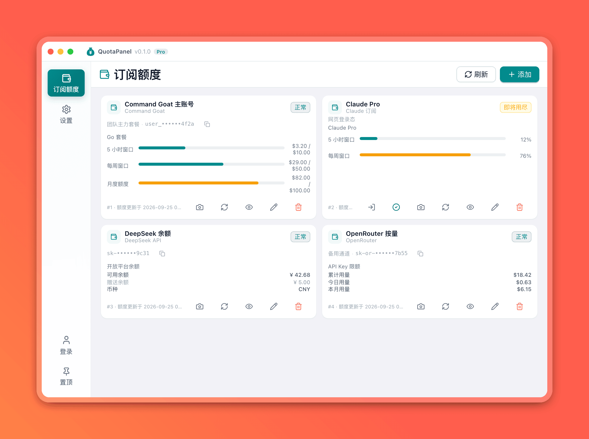
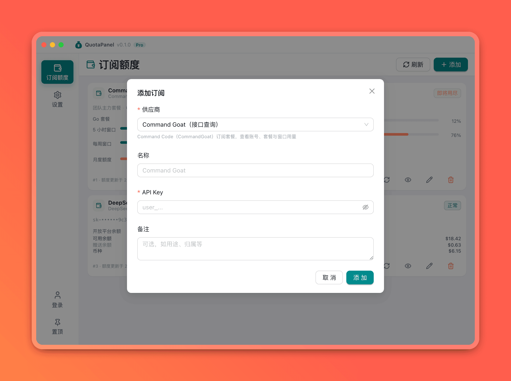
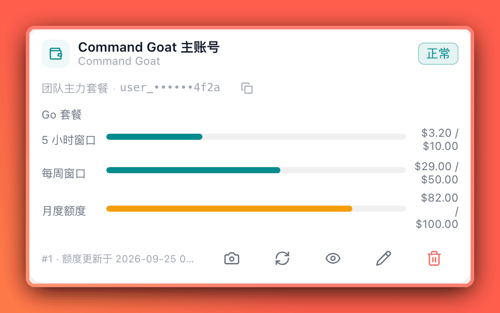
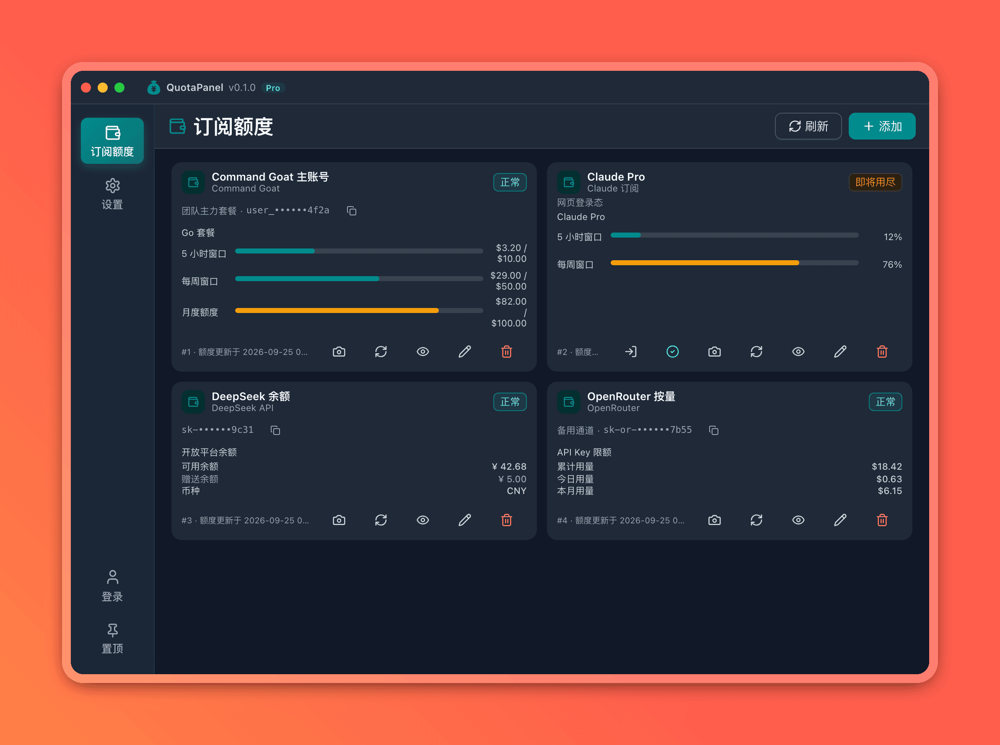
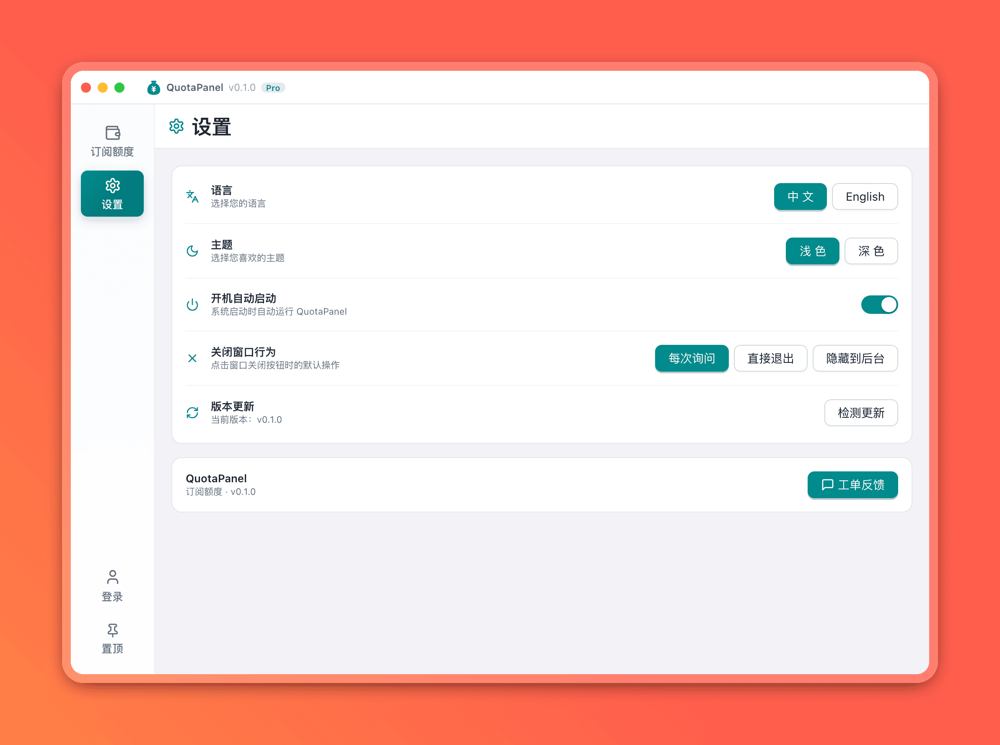

# 🎯 QuotaPanel - AI 订阅额度中心

<div align="center">
  
</div>

> [🇨🇳 中文](README.md) | [🇺🇸 English](README.en-US.md)

<div align="center">
  
  <a href="https://open.tecmz.com/quotapanel"></a>
  <a href="https://github.com/open-tecmz/quotapanel"></a>
  <a href="https://gitee.com/open-tecmz/quotapanel"></a>
  
</div>

## ✨ 项目简介

**QuotaPanel** 是一款开源的桌面端 AI 额度面板，把散落在各家控制台里的订阅与 API 余额集中到一张界面上：Claude、ChatGPT / Codex、Cursor、GitHub Copilot、Z.ai、Kimi、MiniMax、OpenRouter……一次刷新就能看清每个账号的额度窗口、剩余用量和重置时间。

> 🎯 **目标**：订阅再多也不慌，一张面板看完所有 AI 额度。

- 🔐 **本地优先**：账号密钥与浏览器会话全部保存在本机，不上传云端
- 🔄 **自动刷新**：每 5 分钟轮询一次，额度变化实时可见，也可随时手动刷新
- 🌐 **浏览器登录**：需要网页登录的订阅走独立浏览器窗口，登录态持久保存
- 📊 **额度可视化**：进度条 + 余额明细 + 账期/重置时间，状态一眼可见
- 🎨 **深浅主题**：浅色 / 深色一键切换
- 🖥️ **跨平台**：支持 **macOS / Windows / Linux**

## 📋 功能特性

| 功能 | 说明 |
|------|------|
| **多源额度聚合** | 16 种 AI 订阅与 API 额度来源，卡片式统一展示 |
| **额度进度可视化** | 额度窗口、余额明细、用量统计、重置与账期时间一屏呈现 |
| **详情弹窗** | 点击卡片查看全部额度窗口、余额与统计明细 |
| **状态提示** | 正常 / 即将用尽 / 超限 三档状态色，超出阈值主动提示 |
| **密钥管理** | 敏感值默认脱敏展示，支持一键复制 |
| **卡片截图** | 将单张订阅卡片保存为 PNG 分享 |
| **浏览器登录** | 独立 Chrome / Edge 窗口登录，Cookie 持久化，删除账号时一并清理 |
| **定时刷新** | 每 5 分钟自动查询，支持手动刷新单个或全部账号 |
| **多语言** | 简体中文 / English 切换 |
| **开机自启** | 可选随系统启动 |
| **托盘常驻** | macOS 菜单栏 / Windows、Linux 系统托盘，快捷显示、重启、退出 |
| **关闭行为** | 关闭窗口时可选择「每次询问 / 直接退出 / 隐藏到后台」 |

## 🔌 支持的额度来源

### 浏览器登录

| 来源 | 说明 |
|------|------|
| **Claude 订阅** | 在独立登录窗口登录 Claude 后读取 5 小时及每周额度 |
| **ChatGPT / Codex** | 登录 ChatGPT 后读取 Codex 订阅使用窗口 |
| **Cursor** | 登录 Cursor 后读取当前周期用量 |
| **Xiaomi MiMo Token Plan** | 登录小米 MiMo 平台后读取 Token Plan 套餐积分与账户余额 |

### API Key

| 来源 | 说明 |
|------|------|
| **GitHub Copilot** | Premium、聊天与补全额度（需可访问 Copilot 内部用量接口的 GitHub 登录令牌） |
| **Z.ai Coding Plan** | GLM Coding Plan 滚动及每周用量 |
| **Kimi Coding Plan** | Kimi Coding Plan 订阅用量 |
| **MiniMax Token Plan** | 滚动及每周剩余额度 |
| **Devin / Windsurf** | 每日、每周额度及超额余额 |
| **Grok CLI** | Grok CLI 订阅周期额度 |
| **OpenCode** | 官方 Go 套餐的滚动（5 小时）/ 每周 / 月度用量 |
| **Command Goat** | Command Code（CommandGoat）账号、套餐与窗口用量 |
| **DeepSeek API** | DeepSeek 开放平台余额 |
| **Kimi API** | Kimi 国内开放平台余额 |
| **OpenRouter** | 当前 Key 的消费和单 Key 限额 |
| **OpenAI API** | 组织 Admin Key 查询近 30 天 API 费用 |

> 站内及第三方内部接口没有稳定性承诺，网站改版或登录策略变化可能使查询失效。供应商的接入方式与响应映射详见 [`docs/quota-research.md`](docs/quota-research.md)。

## 🖼️ 界面预览

<div align="center">
  
  <p>额度主页</p>
</div>

<table width="100%">
  <thead>
    <tr>
      <th width="50%">新增账号弹窗</th>
      <th width="50%">账号卡片</th>
    </tr>
  </thead>
  <tbody>
    <tr>
      <td></td>
      <td></td>
    </tr>
  </tbody>
  <thead>
    <tr>
      <th>额度主页（深色）</th>
      <th>设置页</th>
    </tr>
  </thead>
  <tbody>
    <tr>
      <td></td>
      <td></td>
    </tr>
  </tbody>
</table>

## 🚀 快速开始

### 📦 下载安装

访问官网 [open.tecmz.com/quotapanel](https://open.tecmz.com/quotapanel) 下载对应系统的安装包，安装后即可使用。

支持 **macOS / Windows / Linux** 三个平台。

### 🛠️ 本地开发

#### 环境要求

- [Go](https://go.dev/dl/) 1.24+
- [Wails v2](https://wails.io/docs/gettingstarted/installation)
- [Node.js](https://nodejs.org/) 20 + [pnpm](https://pnpm.io/)

```bash
# 安装 Wails CLI
go install github.com/wailsapp/wails/v2/cmd/wails@latest

# 安装 pnpm
npm install -g pnpm
```

> Linux 构建还需安装 Wails 的系统依赖（`libgtk-3-dev`、`libwebkit2gtk-4.0-dev` 等），详见 Wails 官方文档。

#### 开发命令

```bash
# 安装 Go 与前端依赖
make install

# 启动开发模式（前端热重载）
make dev

# 构建生产版本（产物在 build/bin/）
make build

# 构建并安装到 /Applications（macOS）
make build-install
```

修改 Go 暴露给前端的方法后，执行 `wails generate module` 重新生成 JS 绑定。

## 📁 项目结构

```
quotapanel/
├── main.go              # Wails 应用配置与入口
├── app*.go              # App 暴露给前端的方法
├── backend/
│   ├── base/            # 基础库（数据库、配置、日志、窗口、平台差异等）
│   └── quota/           # 各额度供应商适配器与查询服务
├── frontend/
│   └── packages/
│       ├── ui/          # 主界面（Vue3 + AntDesignVue + TailwindCSS）
│       └── quota/       # 额度业务模块
├── demo/image/          # 界面截图
├── docs/                # 文档（额度来源调研等）
└── Makefile             # 开发、构建与发布命令
```

## 🗂️ 数据目录

首次启动会在用户目录创建数据目录（默认 `~/.quotapanel/`），保存配置文件、SQLite 数据库与各账号的浏览器会话。可通过环境变量 `QUOTAPANEL_DATA_ROOT` 指定其他位置。

## 🤝 社区交流

> 添加好友请备注 "QuotaPanel"

<table width="100%">
  <thead>
    <tr>
      <th width="50%">💬 微信交流群</th>
      <th>🗣️ QQ 交流群</th>
    </tr>
  </thead>
  <tbody>
    <tr>
      <td></td>
      <td></td>
    </tr>
  </tbody>
</table>

### 🌟 支持我们

- ⭐ 在 [GitHub](https://github.com/open-tecmz/quotapanel) / [Gitee](https://gitee.com/open-tecmz/quotapanel) 上点亮 Star
- 🐛 发现 Bug 或提出建议 → 提交 Issue
- 🔌 新增额度来源 → 参考 `backend/quota/provider_*.go` 实现 `Provider` 接口并 `Register`
- 📖 改进文档 → 欢迎 PR

## 📄 许可证

本项目采用 [Apache-2.0](LICENSE) 许可证开源，**可自由使用、修改和商用**。

---

<div align="center">
  <p>⭐ 如果这个项目对你有帮助，请给我们一个 Star！</p>
</div>
